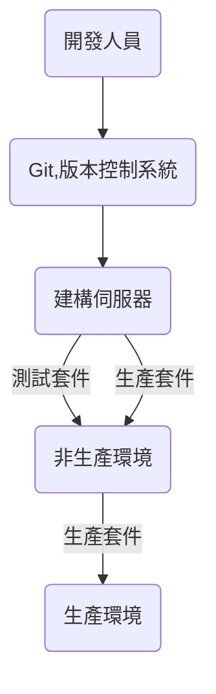
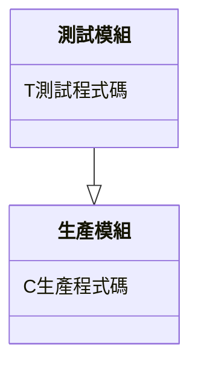
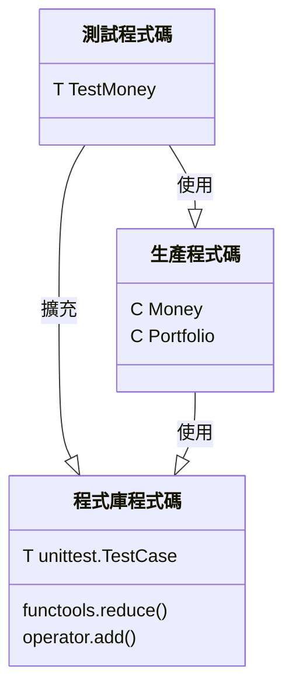

# Chapter 4 ： 關注點分離


## 測試和生產程式碼

前三章我們編寫了兩種不同類型的程式碼 ： 

1. **生產程式碼 (Production Code)** ： **解決我們 Money 問題**的程式碼，這包括了 Money 和 Portfolio 以及其中的所有行為。
2. **測試程式碼 (Test Code)** ： **驗證問題已正確被解決**的程式碼，這包括了支援這些測試所需的所有測試和程式碼。


### $\star$ 單向依賴

$\star$ **測試程式碼依賴於生產程式碼，但是生產程式碼不應該依賴於生產程式碼**
從測試程式碼到生產程式碼間存在著內隱式的依賴關係 ： 

1. 編寫程式碼時，注意不要在生產程式碼中意外使用到任何測試程式碼。
2. 生產程式碼不能呼叫任何測試程式碼。


### $\star$ 依賴注入 (Dependency Injection)

依賴注入 (Dependency Injection) 是一種將物件的建立與它的使用分開的做法。它增加了程式碼的內聚度 (cohesion) ，並減少了它的耦合 (coupling) 。

依賴注入需要**不同的程式單元 (類別和方法) 相互獨立**。將測試和生產程式碼分離是促進依賴注入的重要前提。


### $\star$ 包裝和部署

當我們包裝 (package) 應用程式的程式碼進行部署時，**測試程式碼幾乎都是與生產程式碼分開包裝**，這允許我們獨立的部署生產和測試程式碼。

通常只有生產程式碼會部署在某些''更高''的環境中，例如生產環境 ： 



## 4-1. 模組化

將測試程式碼與生產程式碼分開，解決在測試程式碼中**包含 (include)、匯入 (import)、要求 (require)** 生產程式碼的問題，最重要的是，這必須始終是一種單向依賴的關係 ： 



實務上的模組化步驟 ：

1. 測試和生產程式碼應該放在不同的原始檔中。
2. 程式碼應該使用名稱空間 (namespace) 來清楚的識別哪些實體是一起的。根據不同的程式語言，名稱空間可以稱為**模組**或**套件**。
3. 在可能的情況下，應該有一個明確的程式碼指令—— import、require 或類似的東西 —— 來指出模組間的依賴關係。


## 4-2. 去除冗餘 (Redundancy)

考慮是否需測試 ： 

1. 如果我們刪除一個測試，我們會有相同的測試程式碼覆蓋率嗎？
2. 其中某項測試是否可以驗證重要的邊緣情況？例如，如果我們在其中一個測試中乘以一個非常大的數字，而且我們的目標是確保在不同的 CPU 和作業系統上不會有溢位 / 下溢的話，我們保留這些測試。
3. 不同的測試是否提供了作為活說明文件 (living documentation) 的獨特價值？


$\star$ 衡量所給定的程式碼被測試的多寡 ： 

- 行（或敘述）覆蓋率 (line or statement coverage)
- 分支覆蓋率 (branch coverage)
- 迴圈覆蓋率 (loop coverage)


## 程式碼

結構圖 ： 



### test_money.py

```python
import unittest
from money import Money
from portfolio import Portfolio


class TestMoney(unittest.TestCase):
    def testMultiplication(self):
        tenEuros = Money(10, "EUR")
        twentyEuros = Money(20, "EUR")
        self.assertEqual(twentyEuros, tenEuros.times(2))

    def testDivision(self):
        originalMoney = Money(4002, "KRW")
        expectedMoneyAfterDivision = Money(1000.5, "KRW")
        self.assertEqual(expectedMoneyAfterDivision,
                         originalMoney.divide(4))

    def testAddition(self):
        fiveDollars = Money(5, "USD")
        tenDollars = Money(10, "USD")
        fifthDollars = Money(15, "USD")
        portfolio = Portfolio()  # 宣告一個空的 Portfolio 物件
        portfolio.add(fiveDollars, tenDollars)  # 向此 Portfolio 物件添加多個具有相同貨幣的 Money 物件
        self.assertEqual(fifthDollars, portfolio.evaluate("USD"))  # 以相同貨幣來評估 Portfolio 並將結果與期望的 Money 物件進行比較


if __name__ == "__main__":
    unittest.main()
```


### money.py

```python
class Money:
    def __init__(self, amount, currency):
        self.amount = amount
        self.currency = currency

    def __eq__(self, other):
        return self.amount == other.amount and self.currency == other.currency

    def times(self, multiplier):
        return Money(self.amount * multiplier, self.currency)

    def divide(self, divisor):
        return Money(self.amount / divisor, self.currency)
```


### portfolio.py

```python
import functools
import operator
from money import Money


class Portfolio:
    def __init__(self):
        self.moneys = []

    def add(self, *moneys):
        self.moneys.extend(moneys)

    def evaluate(self, currency):
        total = functools.reduce(operator.add,
                                 map(lambda m: m.amount, self.moneys), 0)  # reduce 最後一個參數是累加結果的初始值
        return Money(total, currency)
```

